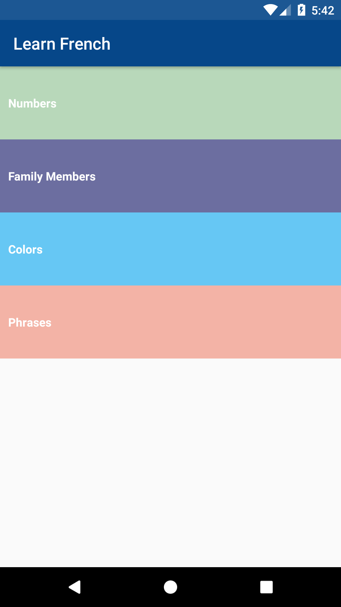
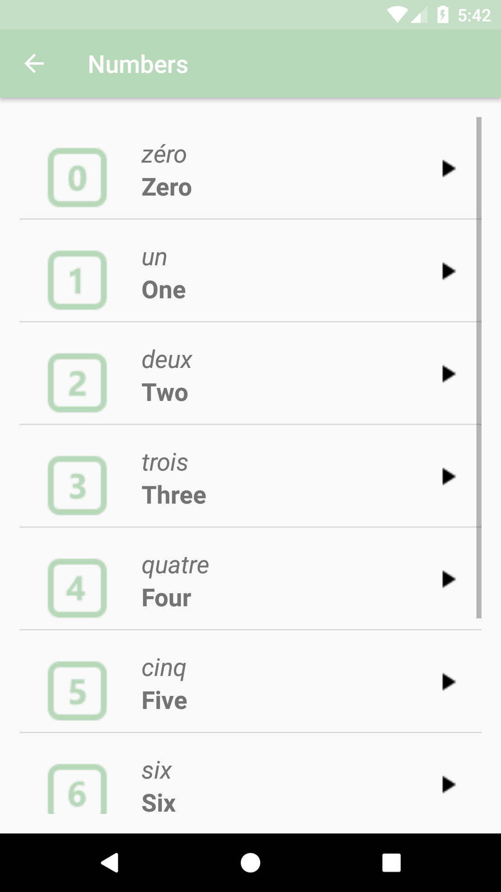
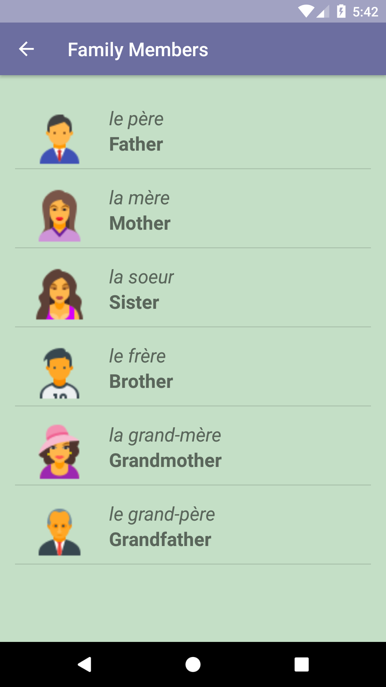
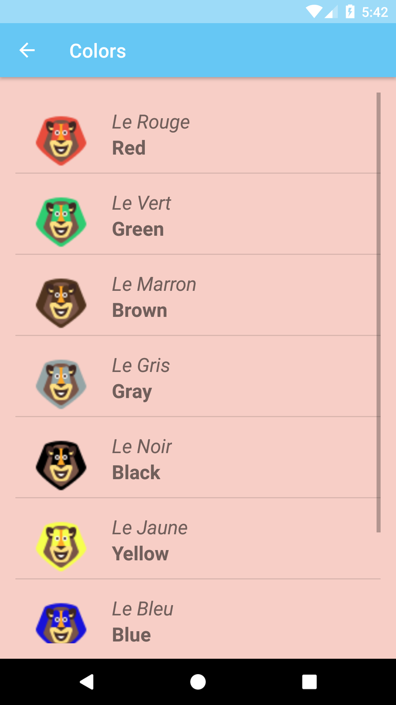
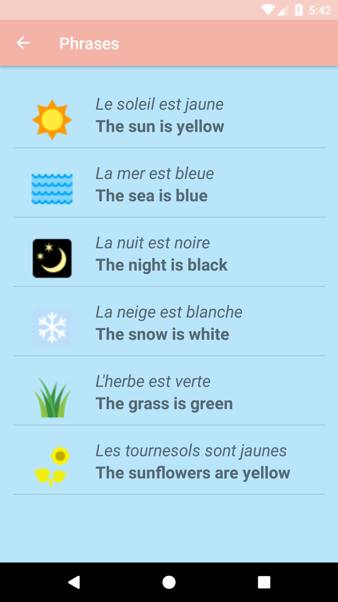

Android app to help kids to learn numbers , colors , family members and some useful phrases with voice pronunciation

What I Learned : 

- How recyclerview works (adapters,listview)

- How audiomanger works

- Experimenting with some UI components

